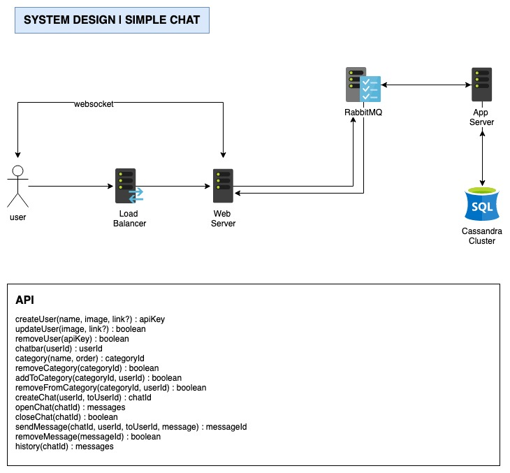
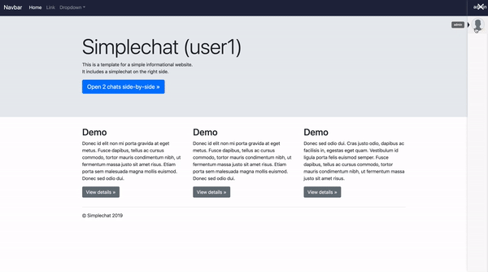

# Simplechat

[](http://ec2-52-212-155-80.eu-west-1.compute.amazonaws.com:8080/job/simplechat/job/master/)

Simple chat was designed with scalability in mind to allow easy integration to any existing project.

## System Design

<a href="https://github.com/huonix/simplechat">
  
</a>

## Prerequisites

* Java 1.8
* NodeJS 11+
* Docker
* Maven
* Cassandra 3
* RabbitMQ 3
* Redis 5

## Installation (macOS only)

```bash
brew cask install docker java8
brew install node maven docker-compose
```

(Don't know homebrew? [brew.sh](https://brew.sh/))

## Development

```bash
git clone git@github.com:huonix/simplechat.git
cd simplechat
npm install --prefix ./frontend
npm install --prefix ./web
mvn -f ./app/simplechat clean package
npm install -D babel-loader @babel/core @babel/preset-env webpack
```

Running the api server

```bash
mvn -f ./app/simplechat clean package
java -jar ./app/simplechat/target/simplechat-0.1.0.jar
```

Running the web(nodejs) server

```bash
npm --prefix ./web run dev
```

Running the frontend

```bash
npm --prefix ./frontend run start
```

## Running via docker-compose

To run a simplechat environment on the same server it's really simple.

```bash
mvn -f ./app/simplechat clean package
npm --prefix ./frontend run build
docker-compose up -d
```

And it's up the simplechat :)
The default port is 8082 so if you're on your local machine you should access it on `http://localhost:8082`

## Example Usage

Include the "frontend/dist/simplechat.prod.js" into your application and begin the chat like this:

```html
<!DOCTYPE html>
<html lang="en">
  <head>
    <meta charset="utf-8">
    <title>Simplechat | Example</title>
  </head>
  <body>
    <div id="simplechat" auth="efe76de1b46c11e99de859912cf8d028"></div>
  </body>
  <script type="text/javascript" src="/simplechat.prod.js"></script>
</html>
```

The auth attribute is the auth key of the user.

## Example View

<a href="https://github.com/huonix/simplechat">
  
</a>

## How can I support the project'?'

If you have found a bug that hasn't been reported yet or want to request a new feature, please open a new issue.

## License

Simplechat is open-source licensed under the [MIT License](/LICENSE).
